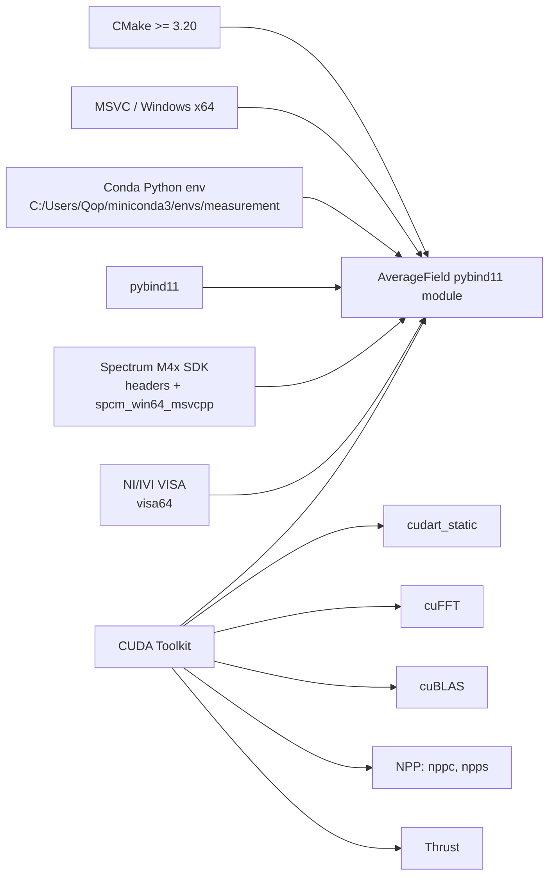
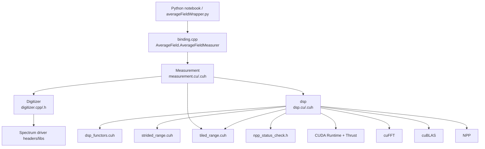
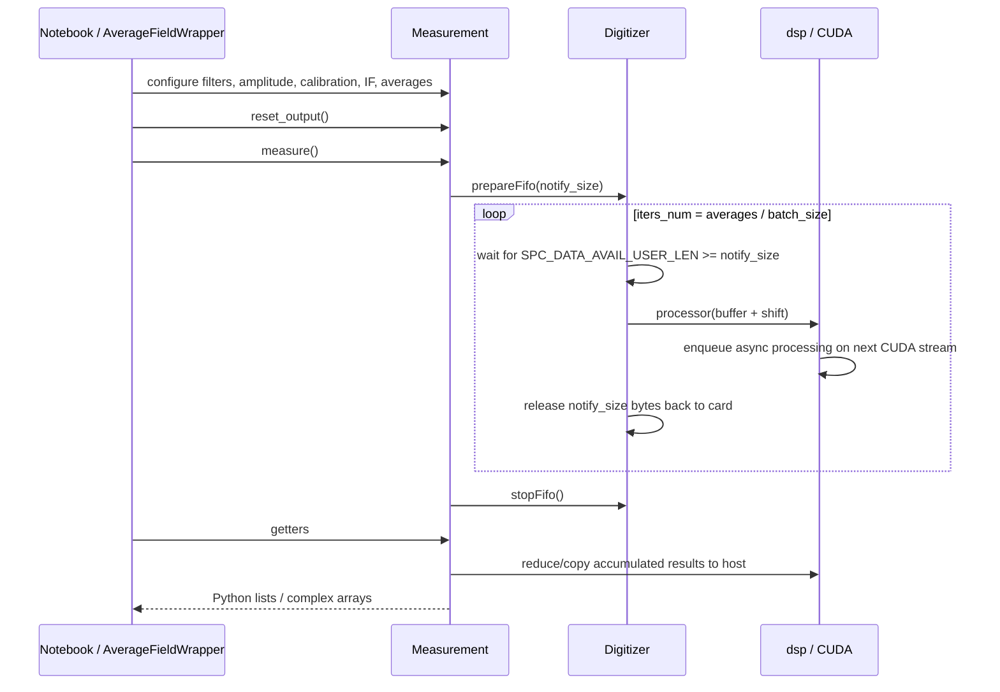
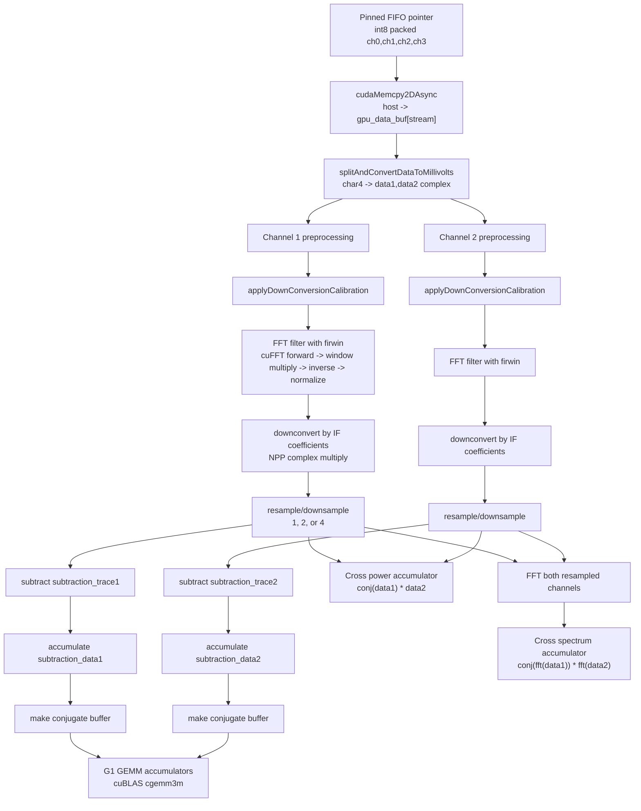

# AverageField_try Branch Audit

Audit date: 2026-05-21  
Repository: `/Users/vvvoskr/Projects/G2_measurement`  
Branch inspected: `AverageField_try` (`c1bbb58`, `origin/AverageField_try`)  
Scope: read-only code audit plus this Markdown report. No source code was changed.

External usage references inspected:

- `/Users/vvvoskr/Projects/QO-measurements/lib2/quantumOptics/averageFieldWrapper.py`
- `/Users/vvvoskr/Projects/QO-measurements/AverageField-try.ipynb`
- `/Users/vvvoskr/Projects/QO-measurements/station.yaml`
- `/Users/vvvoskr/Projects/QO-measurements/MIGRATION.md`

## 1. High-Level Summary

This branch builds a Windows-only `AverageField` Python extension with pybind11, C++20, CUDA, cuFFT, cuBLAS, NPP, Thrust, and Spectrum M4x digitizer driver APIs. The runtime model is:

1. Python configures the Spectrum digitizer and lab instruments in a notebook.
2. Python passes the Spectrum card handle into `AverageField.AverageFieldMeasurer`.
3. `Measurement` wraps the digitizer handle, creates a `dsp` processor, and gives the digitizer a CUDA pinned host buffer.
4. The digitizer fills FIFO chunks; each chunk queues asynchronous GPU work on one of four CUDA streams.
5. GPU code accumulates average fields, G1 correlators, cross power, cross spectrum, and S21-related sums.
6. Python calls getters that copy accumulated GPU results back to NumPy-compatible Python objects.

The current active branch is focused on average field, S21, G1, cross-power, and cross-spectrum. Older G2/interference/filtering paths still exist in code but are mostly commented out or not exposed through pybind11.

The biggest modernization blockers are not algorithmic first. They are build reproducibility, explicit synchronization around async DMA/GPU work, result getter correctness, and a stable Python API contract.

## 2. Repository File Map

Tracked source files:

| File | Role |
| --- | --- |
| `CMakeLists.txt` | Builds pybind11 module `AverageField` from `binding.cpp`, `digitizer.cpp`, `dsp.cu`, `measurement.cu`. Hardcodes Windows conda/CUDA/Spectrum/VISA paths. |
| `binding.cpp` | Pybind11 boundary. Exposes `AverageField.AverageFieldMeasurer` and selected `Measurement` methods. |
| `measurement.cuh`, `measurement.cu` | Session-level orchestration: owns/uses `Digitizer`, owns `dsp`, computes derived sizes, manages averaging iterations, forwards configuration and getters. |
| `digitizer.h`, `digitizer.cpp` | Thin Spectrum M4x wrapper: card parameters, FIFO buffer setup, DMA wait loop, overrun/timeout handling. |
| `dsp.cuh`, `dsp.cu` | GPU processing pipeline: stream resources, buffers, filters, downconversion, calibration, G1/cross-power/cross-spectrum/S21/average-field accumulation. |
| `dsp_functors.cuh` | CUDA/Thrust functors for conversion, calibration, conjugation, downsampling, correlations. |
| `strided_range.cuh`, `tiled_range.cuh` | Thrust iterator helpers used for downsampling/test input/window tiling. |
| `npp_status_check.h` | NPP status-to-string helper used only when `_DEBUG1` checks are enabled. |
| `pinned_allocator.cuh` | Generic CUDA pinned allocator, currently not materially used by the active pipeline. |
| `noise.h` | Gaussian noise helper, not used by the active pybind module path. |
| `main.cpp` | Stale/manual executable experiment harness. Not included in active `pybind11_add_module`; calls some APIs that are currently commented out. |
| `README.md` | One-line project description. |

Important ignored/untracked build inputs:

- `.gitignore` ignores `c_header`, `*.dll`, `*.bat`, `build`, `.vscode`, `*.py`, `*.ipynb`, and other local artifacts.
- This checkout does not contain `c_header`, but `digitizer.cpp` includes Spectrum headers such as `dlltyp.h`, `regs.h`, `spcerr.h`, and `spcm_drv.h`.
- A clean clone of this branch is therefore not buildable without separately restoring vendor headers and libraries.

## 3. Dependency Map

### 3.1 Build-Time Dependencies



Observed build constraints:

- `CMAKE_CXX_STANDARD` and `CMAKE_CUDA_STANDARD` are both `20`.
- `CMAKE_CUDA_ARCHITECTURES` is hardcoded to `75`.
- `CMAKE_CUDA_FLAGS` enables `--extended-lambda`.
- Python and pybind11 paths are hardcoded to `C:/Users/Qop/miniconda3/envs/measurement`.
- `SPCM_ROOT_DIR` is hardcoded to `c_header`, but that directory is ignored and absent in this checkout.
- VISA is linked even though the active source list does not currently include the older Yokogawa/VISA control code.
- The external QO project documents the deployed `.pyd` as `AverageField.cp313-win_amd64.pyd`, with Python locked to 3.13 and CUDA 13 DLL directories registered before import.

### 3.2 Source-Level Dependency Graph



### 3.3 Runtime / Lab Dependencies

The notebook usage adds a broader runtime ecosystem around the compiled module:

- `drivers.Spectrum_m4x.SPCM` creates/configures the Spectrum card and provides `dig.h_card`.
- `AverageFieldWrapper.from_handle(ctypes.addressof(dig.h_card.contents), ...)` passes that card handle to the compiled module.
- HDAWG, Sinolink microwave generators, Yokogawa current sources, VNA, and Signal Hound spectrum analyzer are configured around the same acquisition.
- `averageFieldWrapper.py` manually registers `C:/Program Files/NVIDIA GPU Computing Toolkit/CUDA/v13.0/bin/x64` via `os.add_dll_directory`.
- `station.yaml` also lists CUDA 13 and `C:/Windows/System32` as required native DLL search paths for the deployed `.pyd`.

## 4. Public Python API Contract

The pybind11 module name is `AverageField`. It exposes one class:

```text
AverageField.AverageFieldMeasurer
```

Exposed methods:

- Constructor: `AverageFieldMeasurer(unsigned long long, unsigned long long, long, float, int)`
- Configuration: `set_calibration`, `set_firwin`, `set_corr_downconvert_freqs`, `set_amplitude`, `set_intermediate_frequency`, `set_averages_number`, `set_subtraction_trace`
- Execution: `measure`, `measure_test`, `reset`, `reset_output`, `free`
- Results: `get_g1_correlator`, `get_g1_other_correlators`, `get_average_field`, `get_s21`, `get_cross_power`, `get_cross_spectrum`, `get_subtraction_trace`, `get_subtraction_data`
- Shape helpers: `get_total_length`, `get_trace_length`, `get_out_size`, `get_notify_size`

Wrapper behavior in `/Users/vvvoskr/Projects/QO-measurements/lib2/quantumOptics/averageFieldWrapper.py`:

- Wraps the pybind class with `AverageFieldWrapper`.
- Converts getter outputs to NumPy arrays where possible.
- Provides context-manager and explicit `free()` handling.
- Adds convenience constructors: `from_handle`, `from_digitizer`, `from_test_inputs`.
- Adds plotting for average field, average field FFT, cross power, and cross spectrum.

API drift to note:

- The pybind constructor comment says "for test inputs with out digitizer", but the active 5-argument signature matches the handle-based constructor on Windows x64. The real test-input constructor in `Measurement` has 6 arguments and is not exposed by the binding.
- `AverageFieldWrapper.from_test_inputs(...)` calls a 6-argument constructor that is not exposed by this branch's `binding.cpp`.
- `AverageFieldWrapper.from_digitizer(...)` assumes a `Digitizer*`/object-pointer overload, but pybind does not expose `Measurement(Digitizer*)`.
- `set_corr_downconvert_freqs` is exposed, but the active `dsp::compute` path does not call `calculateInterference`, so those coefficients are currently unused for the exposed average-field/G1/cross-power/cross-spectrum outputs.
- G2-related getters exist in commented code and `main.cpp`, but are not active pybind API in this branch.

## 5. Derived Sizes and Data Layout

Constants:

- `num_streams = 4`
- `num_channels = 2` complex channels
- One complex channel is formed from two int8 digitizer channels: `(I, Q)`.
- The raw digitizer path therefore assumes four physical int8 channels packed as `char4`: `ch0`, `ch1`, `ch2`, `ch3`.

For a measurement:

```text
segment_size              = digitizer SPC_SEGMENTSIZE
batch_size                = segments per GPU batch
trace_length              = round(segment_size * part)
oversampling              = second_oversampling
resampled_trace_length    = trace_length / oversampling
total_length              = batch_size * trace_length
resampled_total_length    = batch_size * resampled_trace_length
out_size                  = resampled_trace_length * resampled_trace_length
notify_size               = 2 * num_channels * segment_size * batch_size bytes
host DMA buffer size      = 4 * notify_size bytes
```

Memory model inside `dsp`:

- One pinned host FIFO buffer allocated by `cudaMallocHost`.
- Four stream lanes, each with its own raw `gpu_data_buf`, complex channel buffers, resampled buffers, G1 accumulators, cross-power accumulator, cross-spectrum accumulator, cuFFT plans, cuBLAS handle, and CUDA stream.
- Stream selection is round-robin via `semaphore`.
- Accumulators are per stream and later summed across all four streams.

## 6. Data Processing Scheme

### 6.1 Acquisition-Level Flow



### 6.2 Per-Batch GPU Pipeline

Active path in `dsp::compute`:



### 6.3 Active Accumulators

| Accumulator | Meaning in active path | Getter |
| --- | --- | --- |
| `subtraction_data1`, `subtraction_data2` | Sum of processed resampled traces after subtraction, per stream and per batch slot | `get_average_field`, `get_subtraction_data`, `get_s21` |
| `g1` | `data1_resampled` x `data2_resampled_conj` GEMM path, labelled in code as `<S1* S2>` | `get_g1_correlator` |
| `g1_annihilation` | `data1_resampled` x `data2_resampled` | `get_g1_other_correlators` |
| `g1_creation` | `data2_resampled_conj` x `data1_resampled_conj` | `get_g1_other_correlators` |
| `g1_reordered` | `data2_resampled_conj` x `data1_resampled` | `get_g1_other_correlators` |
| `cross_power` | Per-time-bin accumulated `conj(data1_resampled) * data2_resampled` | `get_cross_power` |
| `cross_spectrum` | Per-frequency-bin accumulated `conj(FFT(data1_resampled)) * FFT(data2_resampled)` | `get_cross_spectrum` |
| `s21_sum1`, `s21_sum2` | Device-side scalar reduction buffers used by `getS21` | `get_s21` |

Normalization pattern:

- Per-stream GPU accumulators hold sums.
- Most getters sum four streams.
- `dsp` getter often divides by `batch_size`.
- `Measurement` getter divides again by `iters_done`, where `iters_done` is actually the number of processed batches.
- Final intended normalization is therefore by `batch_size * number_of_batches`.

## 7. Notebook Usage Pattern

The notebook uses the module as a long-running compiled acquisition engine rather than as a small per-point Python transform.

Typical setup:

```python
dig = SPCM(b"/dev/spcm0")
dig.setup_external_clock()
dig.set_parameters({
    "channels": [0, 1, 2, 3],
    "ch_amplitude": 200 or 1000,
    "dur_seg": ...,
    "n_seg": 1 << 10,
    "oversampling_factor": 1 or 2,
    "pretrigger": 32,
    "mode": SPCM_MODE.MULTIPLE_FIFO,
    "trig_source": SPCM_TRIGGER.EXT0,
})

afw = AverageFieldWrapper.from_handle(
    ctypes.addressof(dig.h_card.contents),
    averages=1 << 13 ... 1 << 28,
    batch=int(dig_params["n_seg"]),
    part=1,
    second_oversampling=1,
)
afw.set_firwin(...)
afw.set_amplitude(int(dig_params["ch_amplitude"]))
afw.set_calibration(...)
afw.set_intermediate_frequency(...)
afw.reset_output()
afw.measure()
```

Common result reads:

- `afw.get_average_field()` for two complex traces.
- `afw.get_cross_power()` for time-domain cross power.
- `afw.get_cross_spectrum()` for frequency-domain cross spectrum.
- `afw.get_g1_correlator()` and `afw.get_g1_all_correlators()` for two-time correlators.
- `afw.get_s21()` for scalar resonance maps / sweeps.

Notebook patterns seen:

- On/off staged acquisitions around HDAWG and LO state.
- Downconversion calibration uses `IQDownconversionCalibrator(afw=afw)`.
- Average-field sweeps change waveform amplitude, DC offsets, delays, or resonance-finder parameters, then call `afw.reset_output(); afw.measure(); getter`.
- Long acquisitions are common: `1 << 25` to `1 << 28` averages are used/planned.
- `%matplotlib widget` and `ipywidgets` are used for live notebook visualization.

## 8. Findings and Risks

### 8.1 Build Reproducibility Is Incomplete

The branch cannot be built from tracked files alone. `c_header` is ignored and absent, but the code and CMake require Spectrum headers/libs. CUDA, conda, VISA, and Spectrum paths are hardcoded to one Windows machine layout.

Impact:

- Hard to reproduce or rebuild the `.pyd` on a fresh MeasurementPC.
- Hard to know whether the deployed `.pyd` exactly matches this branch.
- Hard to automate even a compile-only check.

Modernization target:

- Add a documented dependency manifest, CMake presets/toolchain file, and a checked-in `README_BUILD.md`.
- Keep vendor binaries out of git if needed, but document exact install locations and versions.
- Make `CONDA_ROOT_DIR`, `SPCM_ROOT_DIR`, `VISA_ROOT_DIR`, and CUDA architecture configurable cache variables.

### 8.2 Potential FIFO Buffer Lifetime Race

`Digitizer::launchFifo` calls `processor(buff_ptr)` and immediately releases the bytes back to the card with `SPC_DATA_AVAIL_CARD_LEN`. But `processor` queues `cudaMemcpy2DAsync` from that host FIFO pointer on a nonblocking stream and returns before the copy is guaranteed complete.

Impact:

- The digitizer may reuse/overwrite the same FIFO region while CUDA is still reading it.
- This can create rare, rate-dependent data corruption that is difficult to diagnose.

Modernization target:

- At minimum, synchronize or record/wait an event for the host-to-device copy before releasing that FIFO span.
- Better: use explicit staging buffers or a small host-buffer pool with CUDA events so DMA and GPU copy overlap safely.

### 8.3 Potential Getter Synchronization Race

The compute path uses `cudaStreamCreateWithFlags(..., cudaStreamNonBlocking)`. Several getters launch default-stream reduction kernels or `cudaMemcpy` without first synchronizing the nonblocking compute streams:

- `dsp::getAverageField`
- `dsp::getS21`
- `dsp::getCrossPower`
- `dsp::getCrossSpectrum`

`getG1Result` and `getG1OtherResults` call `cudaDeviceSynchronize()` indirectly through `getCumulativeTrace`, so they are less exposed.

Impact:

- Calling `get_average_field()` immediately after `measure()` can read incomplete accumulated data.
- Notebook examples often call `get_average_field()` first, before any getter that synchronizes all streams.
- The issue may be hidden if acquisitions are slow enough that GPU work has already finished.

Modernization target:

- Add a single explicit `dsp::synchronize()` after measurement completion or at the start of every getter.
- Prefer stream events if you want to preserve overlap and avoid global `cudaDeviceSynchronize()`.

### 8.4 `getAverageField` Has a Second-Oversampling Shape Bug

`dsp` allocates `tmp1` and `tmp2` with `resampled_trace_length`, but `dsp::getAverageField()` launches and copies using `getTraceLength()`. If `second_oversampling > 1`, this can write/copy past the temporary buffer and return the wrong vector length.

Impact:

- Current notebook examples pass `second_oversampling=1`, so this is dormant there.
- The API advertises oversampling values 1, 2, and 4 through `resample`; future use with 2 or 4 is unsafe.

Modernization target:

- Use `getResampledTraceLength()` consistently for average-field reduction, host vector allocation, kernel grid, and copy size.
- Add tests for `second_oversampling = 1, 2, 4`.

### 8.5 Error Checking Is Mostly Disabled for cuFFT/cuBLAS/NPP

`check_cufft_error`, `check_cublas_error`, and `check_npp_error` only throw under `_DEBUG1`, which is commented out. Several custom kernel launches also lack `cudaGetLastError` checks.

Impact:

- Production builds can silently ignore failed FFT, GEMM, NPP, or kernel calls.
- Later host copies may return stale or partially computed data without a clear exception.

Modernization target:

- Always check library status codes.
- Add `cudaPeekAtLastError`/`cudaGetLastError` after custom kernels, plus event or stream synchronization at defined boundaries.
- Include enough context in exceptions: stream number, operation, dimensions, and current derived sizes.

### 8.6 Averages Handling Silently Drops Remainders

`Measurement::setAveragesNumber` computes:

```text
iters_num = averages / batch_size
```

No remainder is handled or reported. If `averages` is not divisible by `batch_size`, the final partial batch is skipped. If `averages < batch_size`, no processing occurs.

Impact:

- User-requested averages can differ from actual processed averages.
- `iters_done` is named as if it counts traces, but it counts processed batches.

Modernization target:

- Either require divisibility and throw a clear error, or support a final partial batch.
- Rename internal counters (`batches_done`, `requested_segments`) to match semantics.
- Expose actual processed averages to Python.

### 8.7 API and Comment Drift

Examples:

- Binding constructor comment does not match the actual exposed handle constructor behavior.
- `from_test_inputs` in the wrapper does not match active pybind constructors.
- `set_corr_downconvert_freqs` is exposed but unused in the active compute path.
- Stale G2 methods remain in `main.cpp` and commented regions, but not in binding.
- `main.cpp` is not part of the current module build and appears out of sync.

Impact:

- Users cannot infer safe usage from comments alone.
- Future refactors may accidentally revive paths with unallocated buffers or stale assumptions.

Modernization target:

- Define one authoritative Python API contract.
- Keep a small test mode constructor exposed for offline validation.
- Move stale experimental code to an archive or remove it after preserving useful formulas.

### 8.8 Resource Lifetime Is Manual and Brittle

`AverageFieldWrapper.close()` and `.free()` call the native `free()` method manually. Native `Measurement::free()` deletes `processor` and `dig`, then nulls pointers. The destructor calls `free()` if either pointer is non-null.

Additional issue:

- `Digitizer(const char *addr)` opens a card but never sets `created_here = true`, so its destructor will not close that handle. The handle-based constructor correctly treats the handle as borrowed.

Impact:

- Manual `free()` is easy to call while Python still holds a wrapper that allows method calls.
- Native ownership rules are implicit.
- Direct address-based `Digitizer` use can leak a card handle.

Modernization target:

- Use RAII (`std::unique_ptr`) inside `Measurement`.
- Remove public `free()` from the normal Python workflow if possible; rely on deterministic context manager plus destructor safety.
- Track borrowed vs owned digitizer handle explicitly.

### 8.9 Getter Return Types Are Costly

`Measurement::getG1Correlator` builds `std::vector<std::vector<std::complex<double>>>`, while the GPU data is `thrust::complex<float>`. The wrapper then converts this nested Python sequence into NumPy.

Impact:

- Large G1 matrices cause expensive GPU-to-host copy, C++ vector construction, Python object creation, and NumPy conversion.
- For trace lengths in the hundreds or thousands, this becomes a significant bottleneck and memory pressure point.

Modernization target:

- Return NumPy arrays directly via pybind11 buffer/array APIs.
- Prefer `complex64` unless analysis genuinely requires `complex128`.
- For very large correlators, consider chunked result transfer or HDF5 direct writing.

### 8.10 Input Validation Is Thin

Observed gaps:

- Calibration channel index is not range-checked before indexing arrays of size `num_channels`.
- Custom FIR/window lengths are not checked against expected `total_length` or `resampled_total_length`.
- Subtraction trace shapes are not checked before assigning to GPU vectors.
- Unsupported `second_oversampling` is detected only inside `resample`, after construction.

Impact:

- Shape mistakes can become CUDA memory errors or incorrect math later in the pipeline.

Modernization target:

- Validate all Python-facing parameters at the wrapper boundary and native boundary.
- Return shape metadata to Python and use it in wrapper-side assertions.

## 9. Optimization Opportunities

Prioritize correctness first; otherwise performance tuning may stabilize the wrong behavior.

### 9.1 Low-Risk Performance Work

- Avoid repeated full-device synchronization in configuration setters where stream-local work or no sync is enough.
- Precompute and cache filter/downconversion windows by `(trace_length, sampling_rate, cutoff, oversampling)` in Python or native code.
- Replace nested-vector G1 returns with direct NumPy arrays.
- Use pinned host output buffers for frequent result copies.
- Add timing counters around DMA wait, H2D copy, preprocessing, GEMM, cross-power, cross-spectrum, and getter reductions.

### 9.2 Medium-Risk GPU Work

- Fuse `splitAndConvertDataToMillivolts`, calibration, and downconversion into one custom kernel to reduce memory passes.
- Use CUDA events to pipeline FIFO copy, preprocessing, and card-buffer release safely.
- Consider CUDA Graphs for the fixed per-batch DAG if dimensions are stable during a run.
- Revisit whether four independent stream accumulators are optimal for the target GPU. GEMM may already saturate the GPU; too much stream concurrency can add overhead.

### 9.3 Higher-Level Data Model Work

- Treat `afw.measure()` as an atomic engine stage in Python experiments.
- Save each completed stage immediately: `dataset.h5`, `config.json`, `snapshot.json`, and calibration references.
- For G1 matrices, use chunked/compressed storage rather than pickle or ad hoc NumPy files.
- Keep notebook plotting main-thread and incremental, matching the current `%matplotlib widget` regime.

## 10. Suggested Modernization Roadmap

### Phase 0: Reproducible Build Baseline

- Add `README_BUILD.md` with exact Windows, CUDA, Python, pybind11, Spectrum SDK, and VISA requirements.
- Convert hardcoded CMake paths into cache variables.
- Add `CMakePresets.json` for MeasurementPC.
- Document deployed `.pyd` filename and ABI target (`cp313-win_amd64`).
- Add a small build/version function exposed to Python: branch, commit, CUDA runtime version, compiled architecture, trace layout constants.

### Phase 1: Correctness and Safety

- Fix FIFO release vs `cudaMemcpy2DAsync` lifetime using events or a safe staging buffer.
- Synchronize getters with outstanding nonblocking stream work.
- Fix `getAverageField` to use `resampled_trace_length`.
- Always check cuFFT/cuBLAS/NPP statuses.
- Add CUDA kernel launch error checks.
- Validate all Python-facing shapes and channel indices.
- Make averages divisibility explicit.

### Phase 2: Testability

- Expose a true test-input constructor in pybind11.
- Add deterministic test vectors for:
  - raw int8 channel packing,
  - calibration,
  - rectangular FIR window construction,
  - downconversion sign convention,
  - downsampling by 1/2/4,
  - average-field normalization,
  - G1/cross-power/cross-spectrum normalization.
- Add a CPU reference path for small arrays, even if only compiled in test builds.

### Phase 3: Python API Stabilization

- Make `AverageFieldWrapper` the stable user API and hide raw pybind quirks.
- Remove or clearly mark dead methods.
- Return direct NumPy arrays from pybind11.
- Replace manual `free()` usage with context-manager ownership and safe invalidation after close.
- Add typed config objects for common measurement recipes.

### Phase 4: Experiment Modernization

- Keep the current notebook runnable, but move repeated procedures into small experiment modules.
- Store result data with structured metadata: instrument snapshot, config, calibration IDs, and git/native module version.
- Use HDF5/xarray or equivalent chunked storage for large complex arrays.
- Add interrupt handling: completed engine stages are saved immediately; swept loops flush partial data.

## 11. Practical Dependency Checklist for MeasurementPC

Minimum items needed to rebuild/use this branch:

- Windows x64.
- MSVC toolchain compatible with CUDA.
- CMake >= 3.20.
- CUDA Toolkit with cuFFT, cuBLAS, NPP, Thrust; current external docs indicate CUDA 13 runtime DLLs are used by the deployed QO environment.
- Python 3.13 conda environment at or configurable from `C:/Users/Qop/miniconda3/envs/measurement`.
- pybind11 installed in that environment.
- Spectrum M4x driver SDK:
  - Headers: `dlltyp.h`, `regs.h`, `spcerr.h`, `spcm_drv.h`.
  - Library: `spcm_win64_msvcpp`.
  - Runtime DLL: `spcm_win64.dll`.
- IVI/VISA installation if still linked.
- QO project wrapper/runtime path:
  - `/Users/vvvoskr/Projects/QO-measurements/lib2/quantumOptics/AverageField.cp313-win_amd64.pyd`
  - CUDA DLL directory registered before import.

## 12. Key Questions Before Optimization

1. Is `AverageField_try` intended to be the exact source for the deployed `AverageField.cp313-win_amd64.pyd`, or is the deployed binary ahead/behind this branch?
2. Is `second_oversampling` expected to remain `1` in real experiments, or should 2/4 become supported production modes?
3. Is cross-spectrum expected to be normalized by FFT length or intentionally left in raw cuFFT scaling?
4. Should `get_subtraction_data` represent a full batch-shaped subtraction template or a single averaged trace?
5. Are G2/interference paths still scientifically needed, or can they be removed until reintroduced with tests?

## 13. Recommended Immediate Next Actions

1. Make a small correctness branch that adds synchronization at getter boundaries and fixes `getAverageField` shape handling.
2. Expose a true no-digitizer test constructor, then build a tiny Python smoke test that runs `set_test_input`, `measure_test`, and all getters.
3. Document/build-lock the MeasurementPC native environment before doing larger refactors.
4. After correctness is stable, replace nested-vector result returns with pybind11 NumPy arrays; this is likely the best first performance win visible to notebook users.

## 14. Updated Future Requirements

Additional requirements from the project owner:

1. `second_oversampling = 2` and `second_oversampling = 4` should become production-supported modes.
2. The module should eventually support both 2-channel and 4-channel Spectrum acquisition modes.
3. It should be possible to read intermediate averaging results for dynamic plotting before the full requested average count is complete.
4. `dsp` should be audited for algorithmic optimization, not only dependency/code structure.
5. Development will happen on macOS, then changes will be pulled and tested on the Windows MeasurementPC.

These requirements affect the architecture. In particular, 2/4 physical channel support and intermediate snapshots should be designed before aggressive GPU optimization, because they change data layout, accumulator ownership, and which results are computed in a given run.

## 15. `second_oversampling = 2/4` Support Plan

Current state:

- `dsp` accepts `second_oversampling` and has `resample` cases for 1, 2, and 4.
- Resampling is currently simple box averaging:
  - 2: `(s0 + s1) / 2`
  - 4: `(s0 + s1 + s2 + s3) / 4`
- `resampled_trace_length = trace_length / second_oversampling`.
- G1 matrix size scales as `resampled_trace_length^2`, so oversampling 2 and 4 are also major memory/performance levers.

Required fixes before production use:

- `trace_length % second_oversampling == 0` must be validated. Otherwise flattened strided ranges can mix samples across segment boundaries.
- `getAverageField` must use `resampled_trace_length`, not `trace_length`.
- Python-facing shape helpers need clarification:
  - Either keep `get_trace_length()` as raw input length and add `get_resampled_trace_length()`;
  - or redefine `get_trace_length()` to mean output trace length and add `get_raw_trace_length()`.
- Plotting axes in `averageFieldWrapper.py` must include both digitizer oversampling and second-stage oversampling:

```text
effective_sample_rate_MHz = 1250 / digitizer_oversampling / second_oversampling
```

- Custom FIR windows passed from Python must match the internal expected length:
  - pre-resampling FIR: `batch_size * trace_length`
  - post-resampling/correlation FIR: `batch_size * resampled_trace_length`
- `set_subtraction_trace` should validate whether it expects full batch-shaped data or a single trace-shaped average. The current code assigns vectors directly to `subtraction_trace1/2`, whose allocated length is `resampled_total_length`.

Performance effect estimate:

Let `L = trace_length`, `R = L / second_oversampling`, `B = batch_size`.

- G1 accumulator memory scales as `O(R^2)`.
- Each G1 GEMM scales as `O(R^2 * B)`.
- Cross-power/cross-spectrum vectors scale as `O(R * B)`.
- Full-rate preprocessing buffers still scale as `O(L * B)`.

For `L=1800`, `B=1024`:

| second_oversampling | R | G1 matrix entries | Relative G1 cost |
| --- | ---: | ---: | ---: |
| 1 | 1800 | 3,240,000 | 1.0 |
| 2 | 900 | 810,000 | 0.25 |
| 4 | 450 | 202,500 | 0.0625 |

So supporting 2/4 correctly is worth doing early. It is both a feature and the cleanest way to reduce G1 cost.

## 16. 2-Channel and 4-Channel Spectrum Mode Design

Current state:

- `num_channels = 2` means two complex logical channels, not two physical Spectrum channels.
- The raw input path assumes four physical int8 samples packed into `char4`.
- `millivolts_functor` maps:

```text
char4{x,y,z,w} -> data1 = x + i*y, data2 = z + i*w
```

This is exactly a 4-physical-channel IQ mode: CH0/CH1 and CH2/CH3 become two complex fields.

Future channel modes should be explicit. Recommended model:

| Mode name | Physical Spectrum channels | Logical output fields | Raw mapping |
| --- | ---: | ---: | --- |
| `IQ1` | 2 | 1 complex field | `data0 = ch0 + i*ch1` |
| `IQ2` | 4 | 2 complex fields | `data0 = ch0 + i*ch1`, `data1 = ch2 + i*ch3` |
| `REAL2` | 2 | 2 real/complex fields | `data0 = ch0 + 0i`, `data1 = ch1 + 0i` |
| `REAL4` | 4 | 4 real/complex fields | one logical field per physical channel |

The first two modes are closest to the current quantum-optics workflow. If `2-channel mode` means one IQ pair, implement `IQ1` first. If it means two independent real channels, implement `REAL2` separately; the math outputs are different.

Required code architecture changes:

- Replace compile-time `num_channels` assumptions with a runtime `InputLayout`.
- Replace `gpubuf = thrust::device_vector<char4>` with a generic raw `int8_t` GPU buffer or separate `char2`/`char4` specializations.
- Replace `data1`, `data2`, `subtraction_data1`, `subtraction_data2`, etc. with arrays/vectors indexed by logical field.
- Only expose results that make sense for the selected layout:
  - `IQ1`: average field and S21-style scalar/field-amplitude workflows are valid; cross-channel G1/G2/cross-power outputs are impossible because there is only one complex logical field.
  - `IQ2`: current two-field outputs remain valid.
  - `REAL2/REAL4`: downconversion/calibration semantics must be redefined.
- Query channel count from the Spectrum handle if reliable, or pass it explicitly from Python where `dig_params["channels"]` is already known.

Hard design rule:

- Use 2 physical channel mode only for experiments that need average field and/or S21-like scalar results.
- Use 4 physical channel mode for any cross-channel function: G1, G2, cross-power, cross-spectrum, or all-correlator experiments.
- The Python wrapper should reject calls such as `get_g1_correlator()` and future `get_g2_correlator()` when constructed in 2-channel `IQ1` mode, instead of returning zeros or duplicated self-correlations.

Recommended migration path:

1. Add an enum/config field to `Measurement` and Python wrapper, but keep current `IQ2` as default.
2. Implement `IQ1` with a separate unpack kernel and reduced output set.
3. Generalize internal buffers only after the two explicit modes are validated on MeasurementPC.
4. Add shape/availability checks so `get_g1_correlator()` or `get_s21()` cannot silently return nonsense in a one-field mode.

## 17. Intermediate Results and Dynamic Plotting

Yes, intermediate averaging results are possible. There are three practical designs.

### 17.1 Chunked Measurement From Python

Use the existing blocking `measure()` repeatedly with a smaller `averages` value, read getters after each chunk, and do not reset output between chunks.

Conceptually:

```python
afw.reset_output()
afw.set_averages_number(chunk_averages)
for k in range(num_chunks):
    afw.measure()
    traces = afw.get_average_field()
    update_plot(traces, processed=(k + 1) * chunk_averages)
```

Pros:

- Requires little or no native API work.
- Getter calls happen only after a measurement chunk is complete.
- Good first validation path for live plotting.

Cons:

- Starts/stops FIFO each chunk.
- Adds Python and digitizer overhead.
- Plot update rate is limited to chunk duration.
- If trigger/card restart changes the physics sequence, it may not be equivalent to one long acquisition.

### 17.2 Native Progress Callback Inside `measure()`

Add `measure(callback=None, callback_interval_batches=N, snapshot_outputs=...)`. The digitizer loop calls the callback every N batches.

Required details:

- The callback must run at a safe synchronization point. If it reads GPU accumulators, all streams contributing to the snapshot must be synchronized or event-ordered first.
- pybind currently releases the GIL during `measure`; a callback must reacquire the GIL only for the Python call and release it again.
- Full G1 snapshots are expensive. Intermediate plotting should default to cheap outputs:
  - processed averages count,
  - S21 scalar,
  - average field trace,
  - cross-power vector,
  - selected G1 ROI or downsampled preview.
- Inline callback work can slow the FIFO loop and increase hardware-overrun risk.

This is the best long-term user experience if implemented carefully.

### 17.3 Asynchronous Measurement + Polling

Expose `start_measure()`, `poll_snapshot()`, and `stop_measure()` or use a native worker thread.

Pros:

- Python UI can remain responsive.
- Natural fit for live dashboards.

Cons:

- Much more complex: thread lifetime, cancellation, digitizer stop, CUDA stream safety, Python object lifetime, and partial data consistency all need design.
- Should not be the first implementation.

Recommendation:

- Start with chunked measurement to validate plotting and desired outputs.
- Then implement a native callback for cheap snapshots.
- Avoid async polling until the result model and cancellation semantics are settled.

## 18. DSP Algorithmic Optimization Audit

### 18.1 Current Hot Path

Per batch and per stream, the active path performs:

1. Host-to-device copy of raw `char4` data.
2. Unpack and scale raw bytes to two complex float traces.
3. For each of two channels:
   - calibration kernel,
   - cuFFT forward,
   - multiply by FIR window,
   - cuFFT inverse,
   - normalize,
   - NPP downconversion multiply,
   - resample,
   - subtract saved trace,
   - accumulate subtraction data,
   - generate conjugate buffer.
4. Four cuBLAS `cublasCgemm3m` calls for G1-family correlators.
5. Cross-power accumulation.
6. Two more cuFFT forward transforms on resampled data.
7. Cross-spectrum accumulation.

The two largest algorithmic costs are normally:

- G1 GEMMs: `O(number_of_g1_outputs * R^2 * B)`.
- FFT filtering and cross-spectrum FFTs: `O(channels * B * L log L)` plus `O(channels * B * R log R)`.

### 18.2 Biggest Optimization: Compute Only Requested Outputs

The current `compute()` always calculates all active outputs:

- average-field backing data,
- 4 G1-family matrices,
- cross-power,
- cross-spectrum,
- S21 backing data.

But notebook usage often needs only one subset:

- Resonance/S21 sweeps: only `get_s21()`.
- Average-field sweeps: average field, sometimes cross-power.
- G1 experiments: G1 matrices plus maybe average field.
- Debug plots: average field and cross spectrum.

Add an `enabled_outputs` bitmask/config:

```text
AVERAGE_FIELD
S21
CROSS_POWER
CROSS_SPECTRUM
G1_MAIN
G1_ALL
SUBTRACTION_DATA
```

Expected impact:

- S21-only mode can skip the four G1 GEMMs and cross-spectrum FFTs entirely.
- Average-field-only mode can skip G1, cross-power, and cross-spectrum.
- Main-G1-only mode can skip three of four G1 GEMMs.

This should be the first algorithmic optimization because it removes whole computations, not just kernel overhead.

### 18.3 Fuse Lightweight Kernels

Current preprocessing uses many separate Thrust/NPP launches and full memory passes:

- unpack/scale,
- calibration,
- post-IFFT normalization,
- downconversion,
- resampling,
- subtraction,
- accumulation,
- conjugate generation.

Custom kernels can reduce launch count and memory traffic:

1. `unpack_calibrate_kernel`
   - Read raw int8 channel bytes.
   - Apply scale and calibration.
   - Write complex channel buffers.

2. `post_filter_resample_kernel`
   - Read inverse-FFT output.
   - Apply normalization.
   - Apply IF downconversion coefficient.
   - Downsample by 1/2/4.
   - Subtract subtraction trace.
   - Accumulate average-field/subtraction output.
   - Optionally write conjugate output only if G1 needs it.

3. `cross_power_reduce_kernel`
   - If only averaged cross-power is needed, reduce over batch immediately into a length-`R` accumulator instead of storing `B * R` values.

This is a good use of custom CUDA kernels. The arithmetic is simple, memory bandwidth and launch overhead dominate, and the current implementation does multiple passes over the same arrays.

### 18.4 Skip Identity or Near-Identity FIR Filters

Several notebook examples use wide windows such as `set_firwin(-512, 512)`. Depending on sample rate, this may be effectively all-pass.

Add window classification:

- all-pass: skip cuFFT filter entirely,
- zero-pass: reject as invalid,
- narrow/band-pass: use current FFT filter path,
- cached custom window: use as provided.

Expected impact:

- Skipping a filter removes two cuFFT calls and two vector transforms per channel per batch.
- For all-pass acquisition this is likely a major speedup.

### 18.5 Reconsider FFT Filter vs Time-Domain / Polyphase Filtering

The current filter is an ideal rectangular frequency-domain mask. That is exact for the chosen mask but expensive and can ring in time.

Alternatives:

- For broad anti-alias filtering before `second_oversampling`, use a short FIR/polyphase decimator and combine filtering with downsampling.
- For very narrow windows such as a few MHz at GHz sample rates, FFT filtering may remain better than a very long time-domain FIR.
- For fixed IF/downconversion workflows, downconvert first, low-pass filter near DC, and decimate with a polyphase FIR. This can be much cheaper when only a narrow baseband is needed.

Recommendation:

- Keep current FFT filter as a correctness baseline.
- Add all-pass skipping first.
- Prototype a polyphase decimator only for common production settings and compare against the FFT path numerically.

### 18.6 Reduce Accumulator Memory for Average Field, S21, Cross Power, Cross Spectrum

Current `subtraction_data`, `cross_power`, and `cross_spectrum` store batch-shaped arrays of size `B * R` per stream, then getters reduce them over batch.

If the final result is only an averaged length-`R` vector or scalar:

- average field can be accumulated directly into length-`R` sums,
- S21 can be accumulated directly into two scalars,
- cross-power can be accumulated directly into a length-`R` vector,
- cross-spectrum can be accumulated directly into a length-`R` vector after FFT/product.

Keep batch-shaped storage only when `get_subtraction_data()` or debug per-segment analysis requires it.

This change would reduce memory substantially and make intermediate snapshots cheaper.

### 18.7 G1-Specific Optimization

G1 is the expensive part:

```text
cost per GEMM ~ R * R * B complex operations
current active path = 4 GEMMs per batch
```

Options:

- Compute only requested G1 variants (`G1_MAIN` vs `G1_ALL`).
- Use `second_oversampling=2/4` to reduce `R` before GEMM.
- If a physical symmetry is always imposed later in Python, consider whether only one triangular part or one matrix variant is needed. This requires physics validation because cross-channel correlators are not automatically Hermitian.
- Avoid generating conjugate buffers when cuBLAS operation flags can express the desired operation. This is straightforward for some variants, less clear for all four; validate formulas before changing.
- Consider lower precision only after physics tolerances are defined. `cublasCgemm3m` is already a faster complex path with different numerical behavior than standard complex GEMM.

Do not optimize G1 by hand-written matrix multiplication kernels unless profiling proves cuBLAS is not the bottleneck. cuBLAS GEMM is usually the right primitive.

### 18.8 Dynamic Plotting Optimization

For intermediate plotting, do not snapshot full G1 matrices frequently. Better preview outputs:

- running average field,
- S21 scalar,
- cross-power vector,
- selected time-window integral,
- selected G1 submatrix/ROI,
- downsampled G1 preview.

This avoids making plotting the bottleneck and reduces FIFO overrun risk.

### 18.9 Memory Pressure Estimate

Approximate active memory per all four streams, ignoring smaller windows/plans:

```text
raw + full-rate channel buffers:  ~ 80 * B * L bytes
resampled batch buffers:          ~ 256 * B * R bytes
four G1 matrices:                 ~ 128 * R^2 bytes
```

For `L=1800`, `B=1024`:

| second_oversampling | R | Approx active memory |
| --- | ---: | ---: |
| 1 | 1800 | ~1.0 GB plus library workspaces |
| 2 | 900 | ~0.5 GB plus library workspaces |
| 4 | 450 | ~0.3 GB plus library workspaces |

The exact value depends on allocator overhead and cuFFT/cuBLAS workspaces, but the scaling is the important point. Output selection and direct reduced accumulators can reduce this further.

### 18.10 Profiling Plan for MeasurementPC

Because the target hardware is Windows/CUDA/Spectrum-specific, profiling should happen on the MeasurementPC after pulling changes.

Recommended steps:

1. Add native timers around:
   - FIFO wait,
   - H2D copy,
   - unpack/calibration,
   - FIR filter,
   - downconversion/resample/subtraction,
   - G1 GEMMs,
   - cross-power,
   - cross-spectrum FFT/product,
   - getters.
2. Expose timing counters to Python after each run.
3. Run fixed synthetic input with `measure_test()` for repeatable GPU profiling.
4. Run real FIFO acquisition to measure overrun sensitivity.
5. Compare modes:
   - S21-only,
   - average-field-only,
   - G1-main,
   - G1-all,
   - each with `second_oversampling = 1, 2, 4`.

Use Nsight Systems/Compute on the MeasurementPC if available. Without it, CUDA events around major stages are still enough to decide the first optimizations.

## 19. Mac Development / MeasurementPC Testing Workflow

Recommended workflow:

1. Keep source changes platform-neutral where possible.
2. Use macOS for static review, API design, Python wrapper work, and documentation.
3. Do not rely on macOS to compile this module unless a separate CPU-only/test build is added.
4. On MeasurementPC:
   - `git pull`,
   - configure/build with the local CUDA/Python/Spectrum paths,
   - run a no-hardware `measure_test()` smoke test if exposed,
   - run a short hardware acquisition,
   - then run the target long notebook workflow.

To make this practical, add:

- `CMakePresets.json` checked in, with MeasurementPC-specific values overridable by environment variables.
- A tiny `python -m qom_native_smoke` or notebook cell that prints module version, CUDA device, derived sizes, and a small test acquisition result.
- A native `get_build_info()` pybind function returning commit, build date, CUDA version, architecture, and enabled compile options.
- A versioned `.pyd` deployment rule so Python never silently imports an old binary after a rebuild.

## 20. Spectrum FIFO Transfer Benchmark Implications

Project-owner benchmark for the current MeasurementPC/card:

```text
Card: M4i.2212-x8 sn 23037, /dev/spcm0
Host: MeasurementPC
Control Center: 2.43 build 24028 (64 bit)
Library: 7.9 build 24028
Kernel: 6.4 build 23958
PCIe: Gen2 x8, max payload 256 byte
FIFO read plateau: about 2.60 GiB/s for notify sizes >= 128 KiB
Best observed read: 2618.5 MiB/s at 8192 KiB notify size
```

The planned production settings are:

```text
sample_rate = 1.25 GS/s
dur_seg = 1000 ns
n_seg = 1 << 13 = 8192
averages = 1 << 22 = 4194304
second_oversampling = 1, 2, or 4
```

The Python Spectrum driver rounds a 1000 ns segment at 1.25 GS/s from 1250 samples to the next multiple of 32, so the practical segment size is expected to be 1280 samples.

For `n_seg=8192`:

| Physical channels | Logical mode | Notify bytes | Notify size | Host buffer size (`4*notify`) |
| ---: | --- | ---: | ---: | ---: |
| 2 | one IQ trace, `CH0+i*CH1` | 20,971,520 | 20 MiB | 80 MiB |
| 4 | two IQ traces, `CH0+i*CH1`, `CH2+i*CH3` | 41,943,040 | 40 MiB | 160 MiB |

These notify sizes are already far into the measured FIFO plateau. Interrupt overhead should not be the bottleneck for the planned `n_seg`.

The limiting factor is sustained transfer rate versus trigger/pulse repetition period. If the pulse period is equal to the 1000 ns acquired segment duration:

| Physical channels | Raw stream rate | Compare to measured 2.618 GiB/s plateau |
| ---: | ---: | --- |
| 2 | about 2441 MiB/s | technically below the benchmark, but only about 7 percent headroom before GPU copy/processing overhead |
| 4 | about 4883 MiB/s | above the card benchmark; not viable as continuous 1 us-period FIFO streaming |

Minimum repetition period implied by the measured FIFO plateau:

```text
2 physical channels: about 0.93 us minimum, before safety margin
4 physical channels: about 1.86 us minimum, before safety margin
```

Practical recommendation:

- Treat 2-channel IQ at a 1 us pulse period as near-limit. It should be tested early with the real GPU pipeline enabled, not only with the Spectrum internal FIFO speed test.
- Treat 4-channel IQ at a 1 us pulse period as bandwidth-infeasible for continuous streaming. It needs lower average duty cycle, longer repetition period, lower sample rate, fewer samples, or a different acquisition strategy.
- Add a build/test smoke benchmark that prints:
  - active physical channel count,
  - segment size,
  - notify size,
  - host buffer size,
  - estimated raw MiB/s from repetition period,
  - measured acquisition duration,
  - overrun count/errors.

This benchmark should be run before optimizing kernels, because no GPU optimization can compensate for a PCIe FIFO stream rate above the card/host transfer limit.

## 21. MeasurementPC Environment Snapshot

Environment information reported from MeasurementPC on 2026-05-21:

```text
Working tree path: C:\Users\Qop\AverageField
Current branch on MeasurementPC: AverageField_try
Current MeasurementPC HEAD: c21d901 Add c_headers to git
Previous shared branch commit: c1bbb58 Add calculation of abnormal g1 correlators
Python executable tested first: C:\Users\Qop\miniconda3\python.exe
Python version: 3.13.5, MSC v.1929 64 bit (AMD64)
Python extension suffix: .cp313-win_amd64.pyd
Conda envs present: base, measurement, qom
Preferred env for future work: qom
GPU: NVIDIA GeForce RTX 5090
Driver: 580.97
CUDA runtime reported by nvidia-smi: 13.0
GPU memory: 32607 MiB
CUDA toolkit: C:\Program Files\NVIDIA GPU Computing Toolkit\CUDA\v13.0
nvcc: release 13.0, V13.0.48
Spectrum runtime DLL: C:\Windows\System32\spcm_win64.dll
Spectrum headers/libs in active repo: C:\Users\Qop\AverageField\c_header
Spectrum duplicate checkout path: C:\Users\Qop\G2_measurement\c_header
Spectrum example SDK path: C:\Users\Qop\Documents\Spectrum GmbH\Examples\c_cpp\c_header
Spectrum header/lib files confirmed:
  - spcm_drv.h
  - regs.h
  - dlltyp.h
  - spcm_win64_msvcpp.lib
```

Important observations:

- The MeasurementPC `AverageField_try` branch now has commit `c21d901` adding `c_headers` to git. The local development `dev` branch must be rebased/merged onto that commit before source edits, otherwise build cleanup will be based on a stale tree that still lacks the tracked Spectrum headers.
- The first Python commands were run from base conda, not `qom`. Base has NumPy/SciPy/Matplotlib/ipympl but no `pybind11`. Future build commands should explicitly activate `qom`.
- `cmake`, `ninja`, and `cl` were not visible from that PowerShell session. This does not prove they are absent; it only means the current shell PATH does not expose them. On Windows, `cl` is normally available only after opening "x64 Native Tools Command Prompt/PowerShell for VS" or after running `VsDevCmd.bat`.
- In PowerShell, prefer `Get-Command <tool>` or `where.exe <tool>` over bare `where <tool>`, because `where` can resolve to a PowerShell alias rather than the Windows `where.exe`.
- Spectrum SDK headers and import library are now present in the active MeasurementPC repo under `c_header`, matching commit `c21d901 Add c_headers to git`.

Recommended follow-up commands on MeasurementPC, using the intended `qom` environment:

```powershell
conda activate qom
python --version
python -c "import sys,sysconfig; print(sys.executable); print(sysconfig.get_config_var('EXT_SUFFIX'))"
python -m pip list | findstr /I "numpy pybind11 cmake ninja"
python -c "import numpy, pybind11; print('numpy', numpy.__version__, numpy.get_include()); print('pybind11', pybind11.__version__, pybind11.get_cmake_dir())"
Get-Command python
Get-Command cmake -ErrorAction SilentlyContinue
Get-Command ninja -ErrorAction SilentlyContinue
Get-Command cl -ErrorAction SilentlyContinue
where.exe cmake
where.exe ninja
where.exe cl
```

If `cl` is still unavailable, run from a Visual Studio developer shell or locate Visual Studio Build Tools:

```powershell
Get-ChildItem "C:\Program Files\Microsoft Visual Studio" -Filter VsDevCmd.bat -Recurse -ErrorAction SilentlyContinue
Get-ChildItem "C:\Program Files (x86)\Microsoft Visual Studio" -Filter VsDevCmd.bat -Recurse -ErrorAction SilentlyContinue
```

The build cleanup should target this environment explicitly:

- Python ABI: `cp313-win_amd64`
- preferred conda env: `qom`
- CUDA toolkit: `CUDA_PATH=C:\Program Files\NVIDIA GPU Computing Toolkit\CUDA\v13.0`
- GPU architecture: RTX 5090, so CMake should not remain hardcoded only to architecture `75`; it should expose `CMAKE_CUDA_ARCHITECTURES` as a preset/cache value.
